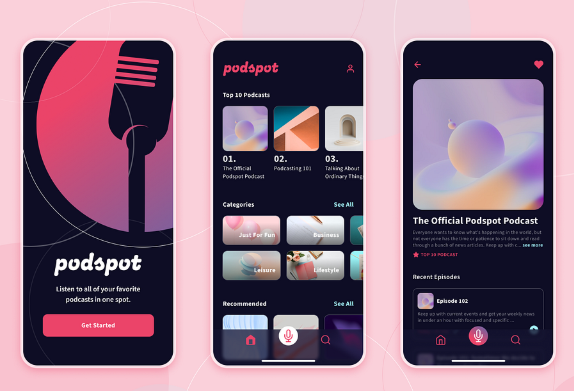

# Portifólio
Este projeto tem como finalidade mostrar o meu trabalho de análise de requisitos e plano de teste.

Neste repositório você irá encontrar a análise de 
2 projetos, sendo um:

- Análise de requisitos de um protótipo figma.
- Plano de Teste de um site.

## Portifólio de Análise de Requisito
- Protótipo do Figma [PodcastApp](https://www.figma.com/design/ECIzSfAWHcPJSi3HxkKdUr/PodcastAppChallenge?node-id=8-5911&p=f)

## Portifólio Plano de Teste
- Site utilizado para elaboração do Plano [SauceDemo](https://www.saucedemo.com)

